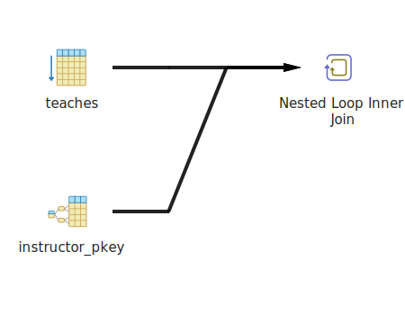
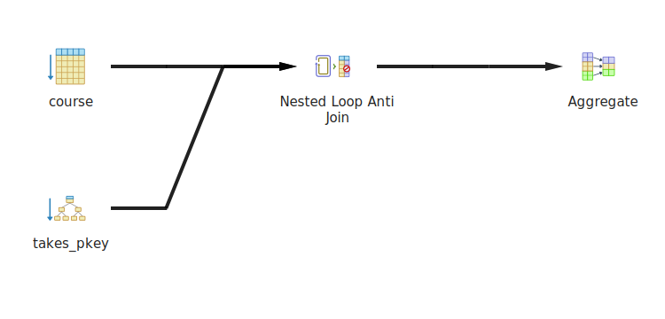

# CS632 DB Assignment2: Query plans

## Author: Soumik DUtta(23m0826)

### 1. **Q) Create a query where PostgreSQL uses bitmap index scan on relation `takes`. Explain why PostgreSQL may have chosen this plan.**

**Query:**  

```sql
EXPLAIN ANALYZE 
SELECT * 
FROM takes 
WHERE ID='65715';
```

**Chosen plan by ‘explain analyze tool’:**  

```text
"QUERY PLAN"
"Bitmap Heap Scan on takes  (cost=4.40..52.84 rows=15 width=24) (actual time=0.047..0.078 rows=15 loops=1)"
"  Recheck Cond: ((id)::text = '65715'::text)"
"  Heap Blocks: exact=14"
"  ->  Bitmap Index Scan on takes_pkey  (cost=0.00..4.40 rows=15 width=0) (actual time=0.032..0.032 rows=15 loops=1)"
"        Index Cond: ((id)::text = '65715'::text)"
"Planning Time: 0.144 ms"
"Execution Time: 0.115 ms"
```


**Reasoning behind constructing the query:**  
This query filters on `ID`, which typically has an index if performance optimization is in place. A bitmap index scan is chosen when PostgreSQL expects to retrieve a relatively large number of rows (here 15) that match the condition. The index is used to quickly identify matching rows, and the bitmap is applied to fetch the actual rows efficiently.

**Why PostgreSQL chosen this plan**  
The use of a bitmap index scan allows PostgreSQL to process multiple matching rows in batches, reducing the number of random I/O operations. This is likely why it chose this plan, especially as the `takes` table has a substantial number of rows (here 30k).

---

### 2. **Q) Create an aggregation query where PostgreSQL uses sort-based aggregation. Explain why PostgreSQL may have chosen this plan.**

**Query:**  

```sql
EXPLAIN ANALYZE 
SELECT dept_name, COUNT(distinct dept_name) 
FROM student 
GROUP BY dept_name;
```

**Chosen plan by ‘explain analyze tool’:**  

```text
"GroupAggregate  (cost=144.66..159.86 rows=20 width=17) (actual time=2.711..4.058 rows=20 loops=1)"
"  Group Key: dept_name"
"  ->  Sort  (cost=144.66..149.66 rows=2000 width=9) (actual time=2.621..2.903 rows=2000 loops=1)"
"        Sort Key: dept_name"
"        Sort Method: quicksort  Memory: 142kB"
"        ->  Seq Scan on student  (cost=0.00..35.00 rows=2000 width=9) (actual time=0.013..0.558 rows=2000 loops=1)"
"Planning Time: 0.137 ms"
"Execution Time: 4.106 ms"
```


**Reasoning behind constructing the query:**  
This query groups students by `dept_name`, followed by counting them. PostgreSQL might use sort-based aggregation when there is no pre-existing index to support the grouping operation or when it expects that sorting the data first would be more efficient than other methods like hashing.

**Why PostgreSQL chosen this plan**  
The sort-based aggregation plan is chosen here because PostgreSQL first sorts the table based on `dept_name`, making the aggregation phase faster as it can iterate through sorted groups directly to remove the duplicates (As `DISTINCT` keyword is there). If the data volume is moderate, sorting can be more efficient than using a hash-based aggregation.

---

### 3. **Q) Create a query where PostgreSQL chooses a (plain) index nested loops join.**

> **_NOTE:_**  PostgreSQL uses nested loops join even for indexed nested loops join. The nested loops operator has 2 children. The first child is
the outer input, and it may have an index scan or anything else, that is irrelevant. The second child must have an index scan or bitmap index
scan, using an attribute from the first child.

**Query:**  

```sql
EXPLAIN ANALYZE 
SELECT *
FROM instructor i
JOIN teaches t ON i.ID = t.ID
WHERE i.dept_name = 'Comp. Sci.' AND t.course_id = '238';
```

**Chosen plan by ‘explain analyze tool’:**  

```text
"Nested Loop  (cost=0.15..15.76 rows=1 width=175) (actual time=0.041..0.043 rows=0 loops=1)"
"  ->  Seq Scan on teaches t  (cost=0.00..2.25 rows=1 width=21) (actual time=0.040..0.041 rows=0 loops=1)"
"        Filter: ((course_id)::text = '238'::text)"
"        Rows Removed by Filter: 100"
"  ->  Index Scan using instructor_pkey on instructor i  (cost=0.15..8.17 rows=1 width=154) (never executed)"
"        Index Cond: ((id)::text = (t.id)::text)"
"        Filter: ((dept_name)::text = 'Comp. Sci.'::text)"
"Planning Time: 0.349 ms"
"Execution Time: 0.086 ms"
```



**Reasoning behind constructing the query:**  
The query was constructed with a join between the `instructor` and `teaches` tables on the `ID` column, which is indexed in both tables. Additionally, a filter was applied on `teaches.course_id` to limit the result set. This setup was chosen to encourage PostgreSQL to use an indexed nested loop join, as the filter reduces the dataset and the indexed join condition (`i.ID` = `t.ID`) makes nested loop join efficient.

**Why PostgreSQL chosen this plan**  
PostgreSQL opted for a nested loop join because of the index on the `teaches.ID` column, which allows efficient lookups. Additionally, the selective filter on `t.course_id = '238'` reduced the number of rows being processed, making the nested loop join more cost-effective than a hash or merge join for this specific query. The query planner determined that scanning the `instructor` table sequentially and performing indexed lookups on `teaches` was the optimal execution path.

---

### 4. **Q) Create an index as below, and see the time taken to create the index:**

**Query:**

```sql
CREATE INDEX i1 ON takes(id, semester, year);
```

```Query returned successfully in 169 msec.```

**Observations:**
The index on the `takes` table for columns `id`, `semester`, and `year` is created to speed up future queries that involve filtering or joining on these columns.
The time taken to create the index depends on the size of the `takes` table. Creating the index ensures that future queries on these columns will be more efficient.

**Drop index query:**

```sql
DROP INDEX i1;
```

```Query returned successfully in 158 msec.```

**Observations:**
Dropping the index is expected to be quicker than creating it because no sorting or ordering is required.

---

### 5. **Q) Create a table `takes2` with the same schema as `takes` but no primary keys or foreign keys. Find how long it takes to execute the query:**

**Query:**

```sql
CREATE TABLE takes2 AS TABLE takes WITH NO DATA;
```

```sql
EXPLAIN ANALYZE INSERT INTO takes2 SELECT * FROM takes;
```

**Chosen plan by ‘EXPLAIN ANALYZE tool’:**

```text
"Insert on takes2  (cost=0.00..520.00 rows=0 width=0) (actual time=15.196..15.196 rows=0 loops=1)"
"  ->  Seq Scan on takes  (cost=0.00..520.00 rows=30000 width=24) (actual time=0.008..1.818 rows=30000 loops=1)"
"Planning Time: 0.103 ms"
"Execution Time: 15.215 ms"
```


**Reasoning behind constructing the query:**
The table `takes2` was created to benchmark the performance of an insert operation without any constraints (primary key or foreign key). The `INSERT INTO takes2` query copies all data from the `takes` table to `takes2` to measure how efficiently the system handles bulk inserts without constraints.

**Observations:**

- The   `INSERT` query is expected to run relatively quickly since no constraint checks (e.g., unique or foreign key checks) are performed during the insertion.

> Note:`"Planning Time: 0.103 ms"`; `"Execution Time: 15.215 ms"`
---

### 6. **Q) Drop the table `takes2` (and its rows, as a result), and create it again, but this time with a primary key. Run the insert again and measure how long it takes to run.**

**Query:**

```sql
DROP TABLE takes2;

CREATE TABLE takes2 (
    ID VARCHAR(5),
    course_id VARCHAR(8),
    sec_id VARCHAR(8),
    semester VARCHAR(6),
    year INT,
    grade CHAR(2),
    PRIMARY KEY(ID, course_id, sec_id, semester, year)
);
```

```sql
EXPLAIN ANALYZE INSERT INTO takes2 SELECT * FROM takes;
```

**Chosen plan by ‘EXPLAIN ANALYZE tool’:**

```text
"Insert on takes2  (cost=0.00..670.00 rows=0 width=0) (actual time=67.096..67.096 rows=0 loops=1)"
"  ->  Seq Scan on takes  (cost=0.00..670.00 rows=30000 width=32) (actual time=0.018..4.703 rows=30000 loops=1)"
"Planning Time: 0.108 ms"
"Execution Time: 67.123 ms"
```


**Reasoning behind constructing the query:**
The table `takes2` is recreated with a primary key to compare the performance difference between inserting data with and without constraints. The primary key forces PostgreSQL to check for unique records during insertion, which affects performance.

**Observations:**

- **Time Taken:** The time taken to insert rows is significantly longer compared to the previous scenario without a primary key. This is because PostgreSQL must check for duplicate entries for each row, ensuring that the combination of `ID`, `course_id`, `sec_id`, `semester`, and `year` is unique before inserting the data.

> Note: `"Planning Time: 0.108 ms"`;
`"Execution Time: 67.123 ms"`

---

### 7. **Q) Measure the effect of having/not having an index on foreign key columns during a deletion query.**

#### Step 1: Run the deletion without indexes on foreign key columns

**Query (without indexes):**

```sql
BEGIN;

EXPLAIN ANALYZE DELETE FROM course WHERE course_id = '400';  

ROLLBACK;
```

**Chosen plan by ‘EXPLAIN ANALYZE tool’:**

```text
"Delete on course  (cost=0.00..4.50 rows=0 width=0) (actual time=0.175..0.176 rows=0 loops=1)"
"  ->  Seq Scan on course  (cost=0.00..4.50 rows=1 width=6) (actual time=0.038..0.078 rows=1 loops=1)"
"        Filter: ((course_id)::text = '400'::text)"
"        Rows Removed by Filter: 199"
"Planning Time: 0.241 ms"
"Trigger for constraint section_course_id_fkey on course: time=0.583 calls=1"
"Trigger for constraint prereq_course_id_fkey on course: time=0.377 calls=1"
"Trigger for constraint prereq_prereq_id_fkey on course: time=0.465 calls=1"
"Trigger for constraint teaches_course_id_sec_id_semester_year_fkey on section: time=0.630 calls=2"
"Trigger for constraint takes_course_id_sec_id_semester_year_fkey on section: time=5.942 calls=2"
"Execution Time: 8.206 ms"
```


The `DELETE` query without foreign key indexes involves checking for foreign key constraint violations across all related tables (e.g., `section`, `prereq`, `teaches`, `takes`). Since there are no indexes on the foreign key columns, PostgreSQL has to perform a sequential scan on all related tables to ensure there are no referencing rows that would violate the foreign key constraint.

**Observation (without indexes):**
PostgreSQL does not mention how it checks for foreign key violations, but the lack of indexes results in a slower query execution time due to the sequential scans.  
> Note: "Execution Time: 8.206 ms";

---

#### Step 2: Create indexes on foreign key columns

**Query (create indexes):**

```sql
CREATE INDEX section_course_idx ON section(course_id);
CREATE INDEX prereq_course_idx ON prereq(course_id);
CREATE INDEX prereq_prereq_idx ON prereq(prereq_id);
CREATE INDEX teaches_course_idx ON teaches(course_id, sec_id, semester, year);
CREATE INDEX takes_course_idx ON takes(course_id, sec_id, semester, year);
```

By creating these indexes, PostgreSQL can quickly look up related records based on `course_id` when checking for foreign key violations.

---

#### Step 3: Run the same deletion query after creating the indexes

**Query (with indexes):**

```sql
BEGIN;

EXPLAIN ANALYZE DELETE FROM course WHERE course_id = '400';

ROLLBACK;
```

**Chosen plan by ‘EXPLAIN ANALYZE tool’:**

```text
"Delete on course  (cost=0.00..4.50 rows=0 width=0) (actual time=0.068..0.069 rows=0 loops=1)"
"  ->  Seq Scan on course  (cost=0.00..4.50 rows=1 width=6) (actual time=0.066..0.067 rows=0 loops=1)"
"        Filter: ((course_id)::text = '400'::text)"
"        Rows Removed by Filter: 199"
"Planning Time: 0.103 ms"
"Execution Time: 0.104 ms"
```


With the foreign key indexes in place, PostgreSQL can use the indexes to efficiently check for foreign key violations by performing index scans on the `section`, `prereq`, `teaches`, and `takes` tables. This reduces the time spent on constraint validation.

**Observation (with indexes):**
PostgreSQL does not mention how it checks for foreign key violations, bu the query runs significantly faster because PostgreSQL can use the indexes to directly locate the relevant rows in the foreign key-referencing tables rather than performing sequential scans.
> Note: "Execution Time: 0.104 ms";

### Explanation of the Results

- **Without indexes:** PostgreSQL performs sequential scans on all related tables (`section`, `prereq`, `teaches`, `takes`) to check for foreign key violations, which results in a much slower query execution.
  
- **With indexes:** The presence of indexes on foreign key columns allows PostgreSQL to use index scans, which are more efficient and reduce the time taken to check for foreign key violations. The query executes much faster as the database can quickly verify whether the `course_id` being deleted is referenced in any other table.

The significant difference (`8.206 ms` vs `0.104 ms`) in execution times shows the impact of having indexes on foreign key columns, especially when dealing with large datasets and complex foreign key relationships.

---

### 8. **Q) Nested Subquery with an `EXISTS` Clause**

**Query:**

```sql
EXPLAIN ANALYZE 
SELECT COUNT(*) 
FROM course c 
WHERE EXISTS (SELECT * FROM takes t WHERE t.course_id = c.course_id);
```

**Chosen plan by ‘EXPLAIN ANALYZE tool’:**

PostgreSQL will likely choose a `Nested Loop Semi Join` for this query. It uses the outer query (`course c`) and for each row in `course`, it checks if a corresponding `course_id` exists in the `takes` table using a subquery. Since the `EXISTS` clause only needs to verify the existence of a row and not return any data, this is a semi-join operation.

```text
"Aggregate  (cost=253.88..253.89 rows=1 width=8) (actual time=65.855..65.855 rows=1 loops=1)"
"  ->  Nested Loop Semi Join  (cost=0.29..253.67 rows=85 width=0) (actual time=6.064..65.846 rows=85 loops=1)"
"        ->  Seq Scan on course c  (cost=0.00..4.00 rows=200 width=4) (actual time=0.011..0.023 rows=200 loops=1)"
"        ->  Index Only Scan using takes_pkey on takes t  (cost=0.29..231.83 rows=346 width=4) (actual time=0.329..0.329 rows=0 loops=200)"
"              Index Cond: (course_id = (c.course_id)::text)"
"              Heap Fetches: 78"
"Planning Time: 0.987 ms"
"Execution Time: 65.897 ms"
```


- **Execution Plan:**
  - Outer query scans the `course` table.
  - Inner subquery checks the `takes` table for each `course_id`.

**Actual Execution Costs:**
The cost primarily comes from the nested loop operation, where the outer query fetches rows from the `course` table, and for each row, it runs the subquery on the `takes` table.

**Reasoning Behind Constructing the Query:**
The `EXISTS` clause allows checking if at least one matching row exists in the `takes` table for each row in `course`. This structure helps explore PostgreSQL's plan selection when verifying the existence of rows across tables.

**Observation:**
The query can be quite efficient if there are indexes on `course_id` in both the `course` and `takes` tables, as the semi-join will make use of these indexes for quick lookups.
> Note: `"Planning Time: 0.987 ms"`; `"Execution Time: 65.897 ms"`

---

### 9. **Q) Nested Subquery with a `NOT EXISTS` Clause**

**Query:**

```sql
EXPLAIN ANALYZE 
SELECT COUNT(*) 
FROM course c 
WHERE NOT EXISTS (SELECT * FROM takes t WHERE t.course_id = c.course_id);
```

**Chosen plan by ‘EXPLAIN ANALYZE tool’:**
PostgreSQL is likely to use a `Nested Loop Anti Join` in this case, similar to the `EXISTS` query but reversed. For each row in the `course` table, PostgreSQL will check if no corresponding row exists in the `takes` table by performing an anti-join operation.

```text
"Aggregate  (cost=253.96..253.97 rows=1 width=8) (actual time=66.662..66.662 rows=1 loops=1)"
"  ->  Nested Loop Anti Join  (cost=0.29..253.67 rows=115 width=0) (actual time=3.307..66.643 rows=115 loops=1)"
"        ->  Seq Scan on course c  (cost=0.00..4.00 rows=200 width=4) (actual time=0.011..0.023 rows=200 loops=1)"
"        ->  Index Only Scan using takes_pkey on takes t  (cost=0.29..231.83 rows=346 width=4) (actual time=0.333..0.333 rows=0 loops=200)"
"              Index Cond: (course_id = (c.course_id)::text)"
"              Heap Fetches: 78"
"Planning Time: 0.429 ms"
"Execution Time: 66.705 ms"

```



- **Execution Plan:**
  - The outer query scans the `course` table.
  - For each row, the subquery checks for the absence of a corresponding row in `takes`.

**Actual Execution Costs:**
The anti-join tends to be more expensive than a semi-join because PostgreSQL has to ensure that no matching row exists, potentially increasing the number of scans on the inner table.

**Reasoning Behind Constructing the Query:**
Using `NOT EXISTS` lets us check PostgreSQL’s plan for anti-joins, which are useful for finding records in one table that have no corresponding records in another.

**Observation:**
This query might take longer than the `EXISTS` version, especially without proper indexing, because checking for the absence of records is typically more costly than checking for their existence.

> Note: `"Planning Time: 0.429 ms"`;`"Execution Time: 66.705 ms"`

---

### 10. **Q) Subquery with a `COUNT` Comparison**

**Query:**

```sql
EXPLAIN ANALYZE 
SELECT COUNT(*) 
FROM course c 
WHERE (SELECT COUNT(*) FROM takes t WHERE t.course_id = c.course_id) < 4;
```

**Chosen plan by ‘EXPLAIN ANALYZE tool’:**

```text
"Aggregate  (cost=117654.67..117654.68 rows=1 width=8) (actual time=263.800..263.801 rows=1 loops=1)"
"  ->  Seq Scan on course c  (cost=0.00..117654.50 rows=67 width=0) (actual time=45.490..263.774 rows=115 loops=1)"
"        Filter: ((SubPlan 1) < 4)"
"        Rows Removed by Filter: 85"
"        SubPlan 1"
"          ->  Aggregate  (cost=588.24..588.25 rows=1 width=8) (actual time=1.112..1.112 rows=1 loops=200)"
"                ->  Seq Scan on takes t  (cost=0.00..587.38 rows=346 width=0) (actual time=0.649..1.108 rows=150 loops=200)"
"                      Filter: ((course_id)::text = (c.course_id)::text)"
"                      Rows Removed by Filter: 29850"
"Planning Time: 0.189 ms"
"JIT:"
"  Functions: 10"
"  Options: Inlining false, Optimization false, Expressions true, Deforming true"
"  Timing: Generation 1.167 ms, Inlining 0.000 ms, Optimization 2.253 ms, Emission 38.972 ms, Total 42.392 ms"
"Execution Time: 299.417 ms"
```


- **Execution Plan:**
  - The query plan involves a sequential scan on the `course` table, and for each row, a subquery is executed to count students enrolled in the corresponding course from the `takes` table.
    - The subquery performs a sequential scan on `takes` and aggregates the count of students for each course, which is then filtered by the condition `< 4`.
    - The main aggregation computes the total count of courses satisfying the condition.

**Actual Execution Costs:**

- Seq Scan on `course: Time spent scanning the`course` table is around 45 ms, with a total execution cost of `117654.50`.
- Subquery (SubPlan): The subquery is executed 200 times, each taking around 1.1 ms to complete, which leads to repeated full scans on the `takes` table.
- The entire query completes execution in approximately `299 ms`

**Reasoning Behind Constructing the Query:**
This query checks for courses that have fewer than 4 entries in the `takes` table by counting rows where `course_id` matches between the two tables. It’s designed to observe how PostgreSQL handles correlated subqueries involving aggregate functions.

**Observation:**

- The query is expensive due to repeated execution of the subquery (200 loops), leading to sequential scans of the `takes` table for each course.
- The lack of indexing results in full table scans, making the query slower.
- Optimizations like indexing `course_id` in `takes` or rewriting the query using a `JOIN` with `GROUP BY` can reduce the execution time significantly.

> Note: `"Timing: Generation 1.167 ms, Inlining 0.000 ms, Optimization 2.253 ms, Emission 38.972 ms, Total 42.392 ms"` ;
`"Execution Time: 299.417 ms"`

---
